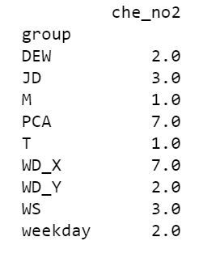
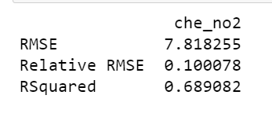
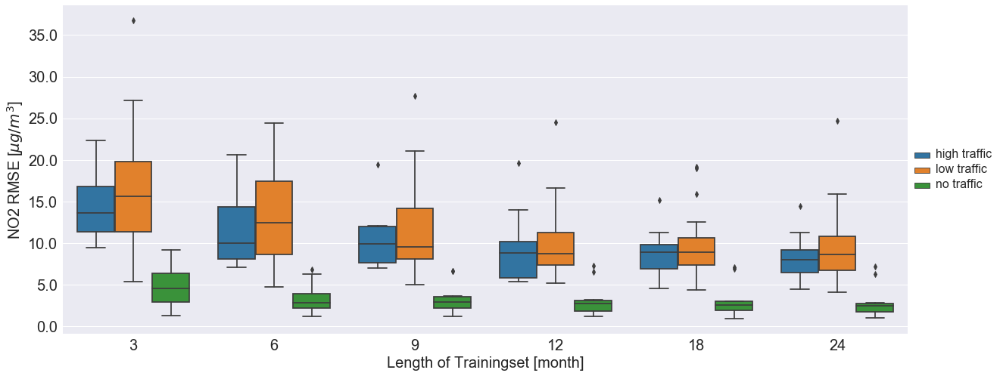
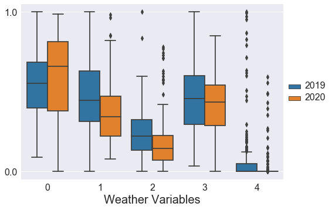
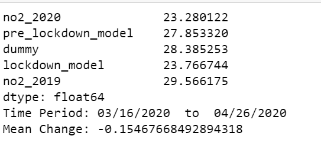
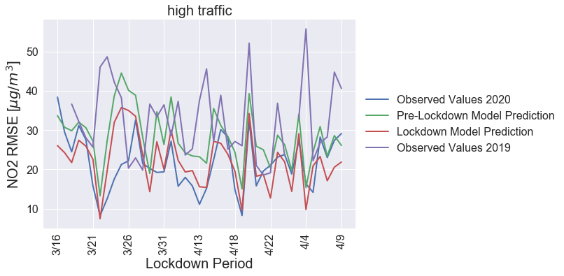
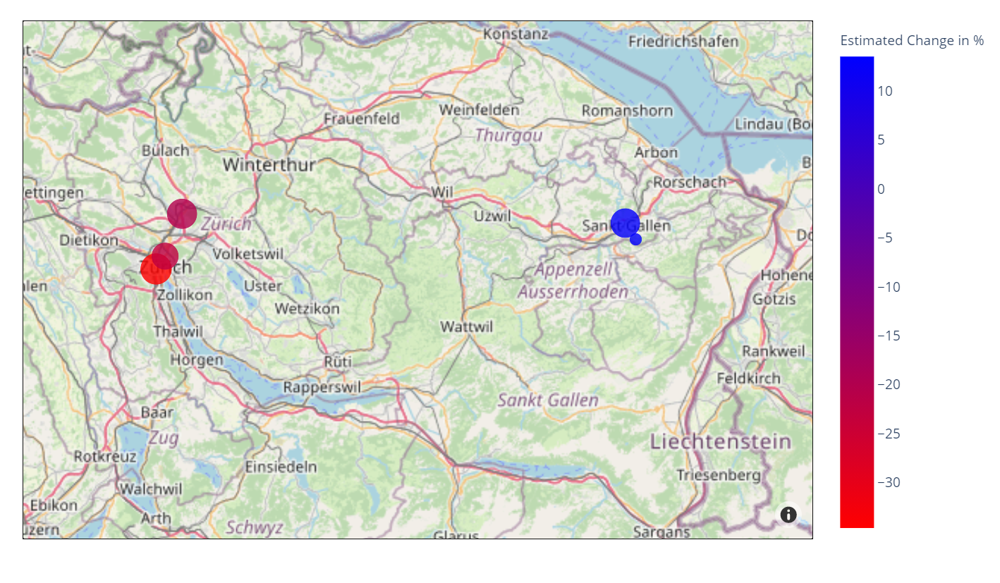
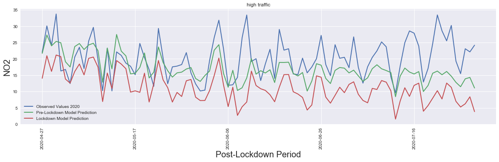
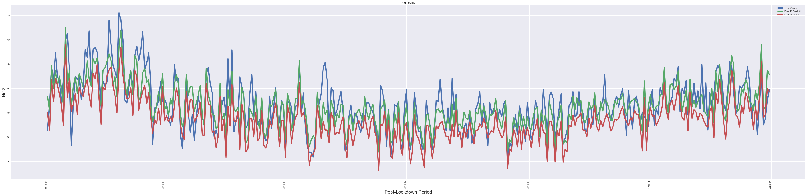

# Understanding the Impact of COVID-19 on Local Air Pollution

## What can you do with this code?
This respository contains code and examples to (1) train a long-term air pollution prediction model with weather variables, (2) estimate the impact of COVID-19 related lockdowns on air pollution and (3) investigate the air pollution reduction potential in traffic. It can be applied to datasets for different countries.
These notebooks can be run using .

## Context
This code was created in the writing of a master thesis. 

## Data 
In order to run these scripts you need a dataset containing daily observations of the air pollutant you want to investigate (e.g. NO2, PM2.5), and the weather variables windspeed, wind direction, humidity and temperature. Additional weather data can easily be incorporated. 
For demonstration purposes, you can find data for 5 stations in East Switzerland in this repository ([Raw Swiss Data](./che/df_che.csv)).
Besides these variables the model uses additional lagged versions, long-term averages and other derivative variables. These can be calculated using the [Generate Variables](Generate_Variables.ipynb) Notebook. 

## Model Selection Algorithm
To predict air pollution concentrations we use a **Generalized Additive Model**. In order to make the decision which variables to include in the model, a model selection algorithm is used. The algorithm is explained in more detail and implemented in [Model Selection](Model_Selection.ipynb).

## Model Training & Evaluation
The selected models (one for every station) are then trained on data before the COVID-19 Lockdown (*pre-LD model*). The trained model is evaluated using cross validation. Training and evaluation are performed in [Model Evaluation](Model_Evaluation.ipynb).

## Prediction & Transfer Model
In the script [Change Estimation Transfer](Change_Estimation_Transfer.ipynb) the following operations are implemented:
### Prediction of the Lockdown Period
In the next step, the trained model is used to predict air pollution during the lockdown period (Lockdown Dates for Austria, Switzerland & China are specified in the file [Dictionaries](dictionaries.py), sources are given in the paper). The difference to the observed values can be used as an estimate for the change of air pollution levels during the lockdown period.

### Transfer Learning - Lockdown Model
The timeframe of the lockdowns (usually about 1 month) is too short to train a seperate GAM model on the data. However, we can create a model for the lockdown period (*LD-model*) using transfer learning, i.e. we keep all relationships between the pollutant and the weather variables fixed (it can be assumed that the influence of weather on pollution will not change significantly within one month) but do retraining for the variable 'weekday' which is used as a proxy for traffic.

### Model Evaluation - Lockdown Model
To evaluate the performance of the lockdown model we again perform cross validation with a 3 day time periods as test sets.

### Post Lockdown Period
We further use the *pre-LD model* and the *LD model* to predict the period after the lockdown. These estimates can be used to infer how much a city has gone 'back-to-normal'.

### Predict 2019
Using the *LD-model* we make 'predictions' for the whole year of 2019, thus it can be estimated how air pollution levels would have changed if the city had been under lockdown for a whole year.

## Plots & Analysis
The outputs of all this scripts can be visualised using the [Plots](Plots.ipynb) script. It contains code to obtain the following statistics and graphics

### Model Selection Outcome
Summarizes the outcome of the model selection algorithm, grouping of the variables can be inferred from [Dictionaries](dictionaries.py).

### Model Evaluation
Whisker plot that shows the model performance in cross validation for different test training set length + overview of model evaluation statistics.

### Wheather Comparison
Boxplot that compares weather conditions in 2019 and 2020 during the time period of the lockdown.

### Estimation of Pollution Change during the Lockdown

Summary table of observed pollutant values in 2020 during the lockdown, prediction of the *pre-LD* model, the dummy prediction (i.e. when not including the weekday variable), the *LD-model* prediction and the observed values of the pollutant in 2019 during the same time period.

Time Series Plot of observed values 2020, observed values 2019, *LD model* prediction and *pre-lD model* prediction for different classes of stations (classification can be found in [Dictionaries](dictionaries.py).

### Spatial Plot of Changes in Pollutant

### Post Lockdown

Plot of the *pre-LD model* and *LD model* as well as true values in 2020 for the period after the lockdown.

### Predict 2019

True values, *pre-LD model* estimates and *LD model* estimates for the whole year 2019.

### Authors
Johanna Einsiedler johanna_einsiedler@gmx.at |
Olga Saukh saukh@csh.ac.at | 
Yun Cheng chengyu@ethz.ch |
Franz Papst papst@csh.ac.at |
